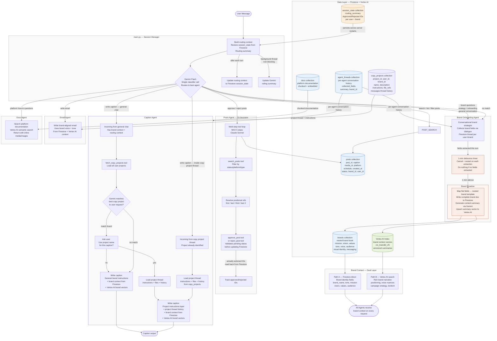

```mermaid
flowchart TD
    USER([User Message]) --> MAIN

    subgraph MAIN_LOOP [main.py — Session Manager]
        MAIN[Build routing context\nRestore session_state from Firestore\nRouting summary]
        MAIN --> GEMINI{Gemini Flash\nSingle classifier call\nRoutes to best agent}
        MAIN -->|after each turn| SAVE_SESSION[Update routing context\nto Firestore session_state]
        MAIN -->|background thread\nnon-blocking| UPDATE_SUMMARY[Update Gemini\nrolling summary]
    end

    GEMINI -->|brand questions\nstrategy / onboarding\ngeneral conversation| ONBOARDING
    GEMINI -->|approve / reject posts| POSTS_AGENT
    GEMINI -->|search / list / filter posts| POST_SEARCH
    GEMINI -->|write caption — general chat| CAPTION_GENERAL
    GEMINI -->|write caption — inside copy project thread| CAPTION_PROJECT
    GEMINI -->|platform how-to questions| DOCS
    GEMINI -->|write email| EMAIL
    GEMINI -->|no match| ONBOARDING

    subgraph ONBOARDING_FLOW [Brand Onboarding Agent]
        ONBOARDING[Conversational brand strategist\nCollects brand fields via dialogue\nFirestore thread per user+brand]
        ONBOARDING -->|fields extracted this turn| DEBOUNCE[1-min debounce timer\nCancel + restart on each extraction\nDo nothing if no fields extracted]
        DEBOUNCE -->|1 min silence| FLUSH
        subgraph FLUSH_FLOW [Brand Finalizer]
            FLUSH[Map flat fields → nested brand template\nWrite complete brand doc to Firestore\nGenerate context summary via Gemini\nUpsert summary vector to Vertex AI]
        end
    end

    subgraph DATA_STORES [Data Layer — Firestore + Vertex AI]
        BRAND_DB[(brands collection\nnested brand book\nmission, vision, values\ntone, voice, audience\nvisual identity, messaging)]
        VERTEX_BRAND[(Vertex AI Index\nbrand context vectors\nctx_brandid_vN\nversioned summaries)]
        POSTS_DB[(posts collection\npost_id, caption\nmedia_id, platform\nschedule, created_at\nstatus, brand_id, user_id)]
        SESSION_DB[(session_state collection\nrouting_summary\nApproved/Rejected IDs\nper user + brand)]
        AGENT_THREADS[(agent_threads collection\nper-agent conversation history\ncollected_fields\nsummary, brand_id)]
        DOCS_DB[(docs collection\nplatform documentation\nchunked + embedded)]
        COPY_PROJECTS_DB[(copy_projects collection\nproject_id, user_id, brand_id\nname, description\ninstructions, file_refs\nmessages thread history)]
    end

    FLUSH --> BRAND_DB
    FLUSH --> VERTEX_BRAND

    subgraph POSTS_AGENT_FLOW [Posts Agent — Orchestrator]
        POSTS_AGENT[Multi-step tool loop\nMAX 5 steps\nClaude Sonnet]
        POSTS_AGENT --> SEARCH_POSTS_T[search_posts tool\nFilter by status/platform/type]
        SEARCH_POSTS_T --> RESOLVE[Resolve positional refs\nfirst / last / third / last 2]
        RESOLVE --> POST_TOOL[approve_post tool\nor reject_post tool\nValidates pending status\nbefore updating Firestore]
        POST_TOOL -->|actually actioned IDs\nread back from Firestore| TRACK[Track approved/rejected IDs]
    end

    POST_SEARCH --> POSTS_DB
    POSTS_AGENT --> POSTS_DB

    subgraph CAPTION_FLOW [Caption Agent]
        CAPTION_GENERAL[Incoming from general chat\nHas brand context + routing context]
        CAPTION_GENERAL --> FETCH_PROJ[fetch_copy_projects tool\nLoad all user projects]
        FETCH_PROJ --> GEMINI_MATCH{Gemini matches\nbest copy project\nto user request?}
        GEMINI_MATCH -->|match found| CONFIRM[Ask user:\nUse project name\nfor this caption?]
        CONFIRM -->|yes| USE_PROJECT[Load project thread\ninstructions + files + history]
        CONFIRM -->|no| WRITE_GEN[Write caption\nGeneral brand instructions\n+ brand context from Firestore\n+ Vertex AI brand vectors]
        GEMINI_MATCH -->|no match| WRITE_GEN
        USE_PROJECT --> WRITE_WITH_PROJECT[Write caption\nProject instructions layer\n+ project thread history\n+ brand context from Firestore\n+ Vertex AI brand vectors]

        CAPTION_PROJECT[Incoming from copy project thread\nProject already identified]
        CAPTION_PROJECT --> LOAD_THREAD[Load project thread\ninstructions + files + history\nfrom copy_projects]
        LOAD_THREAD --> WRITE_WITH_PROJECT
    end

    WRITE_GEN --> CAPTION_OUT([Caption output])
    WRITE_WITH_PROJECT --> CAPTION_OUT

    subgraph EMAIL_FLOW [Email Agent]
        EMAIL[Write brand-aligned email\nUses brand voice + tone\nFrom Firestore + Vertex AI context]
    end

    subgraph DOCS_FLOW [Docs Agent]
        DOCS[Search platform documentation\nVertex AI semantic search\nReturn with inline media/images]
    end

    subgraph BRAND_CONTEXT [Brand Context — Dual Layer]
        FAST_LOOKUP[Path A — Firestore direct\nBrand identity fields\nbrand_name, tone, mission\nvision, values, audience]
        SEMANTIC[Path B — Vertex AI search\nRich brand narrative\npositioning, voice nuances\ncampaign strategy, do/dont]
    end

    BRAND_DB --> FAST_LOOKUP
    VERTEX_BRAND --> SEMANTIC
    FAST_LOOKUP --> ALL_AGENTS([All Agents receive\nbrand context on every request])
    SEMANTIC --> ALL_AGENTS

    SESSION_DB -->|persists across server restarts| MAIN
    AGENT_THREADS -->|per-agent conversation history| ONBOARDING
    AGENT_THREADS -->|per-agent conversation history| EMAIL
    COPY_PROJECTS_DB -->|project thread + instructions| CAPTION_FLOW
    DOCS_DB -->|chunked documentation| DOCS

    style BRAND_DB fill:#E6F1FB,stroke:#185FA5
    style VERTEX_BRAND fill:#EAF3DE,stroke:#3B6D11
    style POSTS_DB fill:#E6F1FB,stroke:#185FA5
    style SESSION_DB fill:#FAEEDA,stroke:#BA7517
    style AGENT_THREADS fill:#E6F1FB,stroke:#185FA5
    style DOCS_DB fill:#E6F1FB,stroke:#185FA5
    style COPY_PROJECTS_DB fill:#EEEDFE,stroke:#534AB7
    style DEBOUNCE fill:#FAECE7,stroke:#993C1D
    style FLUSH fill:#FAECE7,stroke:#993C1D
    style FLUSH_FLOW fill:#FFF5F0,stroke:#993C1D
    style DATA_STORES fill:#F9F9F9,stroke:#888780
    style MAIN_LOOP fill:#F9F9F9,stroke:#888780
    style POSTS_AGENT_FLOW fill:#F9F9F9,stroke:#888780
    style CAPTION_FLOW fill:#F9F9F9,stroke:#534AB7
    style ONBOARDING_FLOW fill:#F9F9F9,stroke:#888780
    style BRAND_CONTEXT fill:#F9F9F9,stroke:#888780
    style EMAIL_FLOW fill:#F9F9F9,stroke:#888780
    style DOCS_FLOW fill:#F9F9F9,stroke:#888780
```

