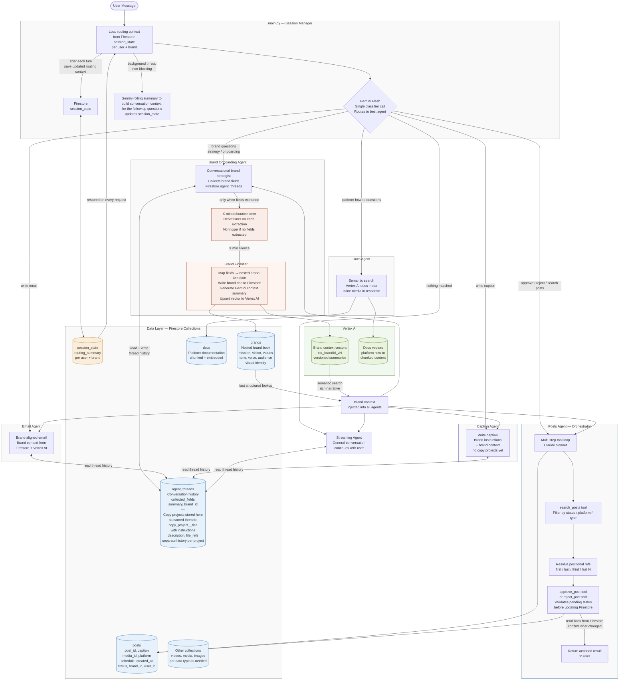

```mermaid
flowchart TD
    USER([User Message]) --> MAIN

    subgraph MAIN_LOOP [main.py — Session Manager]
        MAIN[Load routing context\nfrom Firestore session_state\nper user + brand]
        MAIN --> GEMINI{Gemini Flash\nSingle classifier call\nRoutes to best agent}
        MAIN -->|after each turn\nsave updated routing context| SAVE_SESSION[Firestore\nsession_state]
        MAIN -->|background thread\nnon-blocking| UPDATE_SUMMARY[Gemini rolling summary to build conversation context for the follow up questions\nupdates session_state]
    end

    GEMINI -->|platform how-to questions| DOCS
    GEMINI -->|write email| EMAIL
    GEMINI -->|write caption| CAPTION
    GEMINI -->|approve / reject / search posts| POSTS_AGENT
    GEMINI -->|brand questions\nstrategy / onboarding| ONBOARDING
    GEMINI -->|nothing matched| STREAMING[Streaming Agent\nGeneral conversation\ncontinues with user]

    subgraph DOCS_FLOW [Docs Agent]
        DOCS[Semantic search\nVertex AI docs index\nInline media in response]
    end

    subgraph EMAIL_FLOW [Email Agent]
        EMAIL[Brand-aligned email\nBrand context from\nFirestore + Vertex AI]
    end

    subgraph CAPTION_FLOW [Caption Agent]
        CAPTION[Write caption\nBrand instructions\n+ brand context\nno copy projects yet]
    end

    subgraph POSTS_AGENT_FLOW [Posts Agent — Orchestrator]
        POSTS_AGENT[Multi-step tool loop\nClaude Sonnet]
        POSTS_AGENT --> SEARCH_POSTS_T[search_posts tool\nFilter by status / platform / type]
        SEARCH_POSTS_T --> RESOLVE[Resolve positional refs\nfirst / last / third / last N]
        RESOLVE --> POST_TOOL[approve_post tool\nor reject_post tool\nValidates pending status\nbefore updating Firestore]
        POST_TOOL -->|read back from Firestore\nconfirm what changed| RESULT[Return actioned result\nto user]
    end

    subgraph ONBOARDING_FLOW [Brand Onboarding Agent]
        ONBOARDING[Conversational brand strategist\nCollects brand fields\nFirestore agent_threads]
        ONBOARDING -->|only when fields extracted| DEBOUNCE[X-min debounce timer\nReset timer on each extraction\nNo trigger if no fields extracted]
        DEBOUNCE -->|X min silence| FLUSH
        subgraph FLUSH_FLOW [Brand Finalizer]
            FLUSH[Map fields → nested brand template\nWrite brand doc to Firestore\nGenerate Gemini context summary\nUpsert vector to Vertex AI]
        end
    end

    subgraph DATA_LAYER [Data Layer — Firestore Collections]
        SESSION_DB[(session_state\nrouting_summary\nper user + brand)]

        AGENT_THREADS_DB[(agent_threads\nConversation history\ncollected_fields\nsummary, brand_id\n---\nCopy projects stored here\nas named threads:\ncopy_project__title\nwith instructions\ndescription, file_refs\nseparate history per project)]

        BRAND_DB[(brands\nNested brand book\nmission, vision, values\ntone, voice, audience\nvisual identity)]

        POSTS_COL[(posts\npost_id, caption\nmedia_id, platform\nschedule, created_at\nstatus, brand_id, user_id)]

        DOCS_COL[(docs\nPlatform documentation\nchunked + embedded)]

        OTHER_COL[(Other collections\nvideos, media, images\nper data type as needed)]
    end

    subgraph VERTEX_LAYER [Vertex AI]
        VERTEX_BRAND[(Brand context vectors\nctx_brandid_vN\nversioned summaries)]
        VERTEX_DOCS[(Docs vectors\nplatform how-to\nchunked content)]
    end

    FLUSH --> BRAND_DB
    FLUSH --> VERTEX_BRAND

    POSTS_AGENT --> POSTS_COL
    POST_TOOL --> POSTS_COL
    DOCS --> DOCS_COL
    DOCS --> VERTEX_DOCS

    BRAND_DB -->|fast structured lookup| BRAND_CTX[Brand context\ninjected into all agents]
    VERTEX_BRAND -->|semantic search\nrich narrative| BRAND_CTX
    BRAND_CTX --> ONBOARDING
    BRAND_CTX --> EMAIL
    BRAND_CTX --> CAPTION
    BRAND_CTX --> POSTS_AGENT
    BRAND_CTX --> STREAMING

    ONBOARDING <-->|read + write\nthread history| AGENT_THREADS_DB
    EMAIL <-->|read thread history| AGENT_THREADS_DB
    CAPTION <-->|read thread history| AGENT_THREADS_DB
    STREAMING <-->|read thread history| AGENT_THREADS_DB

    SAVE_SESSION <--> SESSION_DB
    SESSION_DB -->|restored on every request| MAIN

    style SESSION_DB fill:#FAEEDA,stroke:#BA7517
    style AGENT_THREADS_DB fill:#E6F1FB,stroke:#185FA5
    style BRAND_DB fill:#E6F1FB,stroke:#185FA5
    style POSTS_COL fill:#E6F1FB,stroke:#185FA5
    style DOCS_COL fill:#E6F1FB,stroke:#185FA5
    style OTHER_COL fill:#E6F1FB,stroke:#185FA5
    style VERTEX_BRAND fill:#EAF3DE,stroke:#3B6D11
    style VERTEX_DOCS fill:#EAF3DE,stroke:#3B6D11
    style DEBOUNCE fill:#FAECE7,stroke:#993C1D
    style FLUSH fill:#FAECE7,stroke:#993C1D
    style FLUSH_FLOW fill:#FFF5F0,stroke:#993C1D
    style DATA_LAYER fill:#F9F9F9,stroke:#888780
    style VERTEX_LAYER fill:#F0F8F0,stroke:#3B6D11
    style MAIN_LOOP fill:#F9F9F9,stroke:#888780
    style POSTS_AGENT_FLOW fill:#F9F9F9,stroke:#185FA5
    style CAPTION_FLOW fill:#F9F9F9,stroke:#534AB7
    style ONBOARDING_FLOW fill:#F9F9F9,stroke:#888780
    style EMAIL_FLOW fill:#F9F9F9,stroke:#888780
    style DOCS_FLOW fill:#F9F9F9,stroke:#888780
```
``
