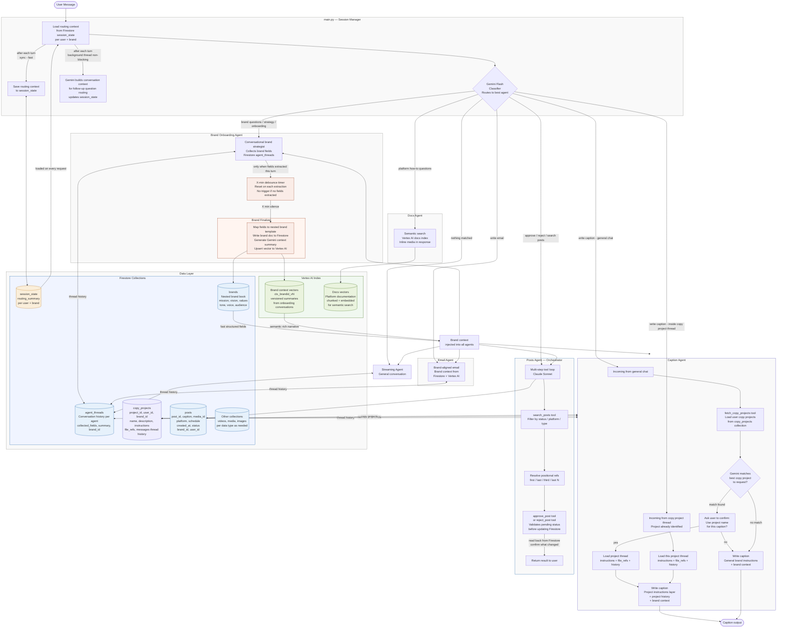

```mermaid
flowchart TD
    USER([User Message]) --> MAIN

    subgraph MAIN_LOOP [main.py — Session Manager]
        MAIN[Load routing context\nfrom Firestore session_state\nper user + brand]
        MAIN --> GEMINI{Gemini Flash\nClassifier\nRoutes to best agent}
        MAIN -->|after each turn\nsync - fast| SAVE_SESSION[Save routing context\nto session_state]
        MAIN -->|after each turn\nbackground thread non-blocking| UPDATE_SUMMARY[Gemini builds conversation context\nfor follow-up question routing\nupdates session_state]
    end

    GEMINI -->|platform how-to questions| DOCS
    GEMINI -->|write email| EMAIL
    GEMINI -->|write caption - general chat| CAPTION_GENERAL
    GEMINI -->|write caption - inside copy project thread| CAPTION_PROJECT
    GEMINI -->|approve / reject / search posts| POSTS_AGENT
    GEMINI -->|brand questions / strategy / onboarding| ONBOARDING
    GEMINI -->|nothing matched| STREAMING[Streaming Agent\nGeneral conversation]

    subgraph DOCS_FLOW [Docs Agent]
        DOCS[Semantic search\nVertex AI docs index\nInline media in response]
    end

    subgraph EMAIL_FLOW [Email Agent]
        EMAIL[Brand-aligned email\nBrand context from\nFirestore + Vertex AI]
    end

    subgraph CAPTION_FLOW [Caption Agent]
        CAPTION_GENERAL[Incoming from general chat]
        CAPTION_GENERAL --> FETCH_PROJ[fetch_copy_projects tool\nLoad user copy projects\nfrom copy_projects collection]
        FETCH_PROJ --> GEMINI_MATCH{Gemini matches\nbest copy project\nto request?}
        GEMINI_MATCH -->|match found| CONFIRM[Ask user to confirm:\nUse project name\nfor this caption?]
        CONFIRM -->|yes| USE_PROJECT[Load project thread\ninstructions + file_refs + history]
        CONFIRM -->|no| WRITE_GEN[Write caption\nGeneral brand instructions\n+ brand context]
        GEMINI_MATCH -->|no match| WRITE_GEN
        USE_PROJECT --> WRITE_PROJECT[Write caption\nProject instructions layer\n+ project history\n+ brand context]

        CAPTION_PROJECT[Incoming from copy project thread\nProject already identified]
        CAPTION_PROJECT --> LOAD_THREAD[Load this project thread\ninstructions + file_refs + history]
        LOAD_THREAD --> WRITE_PROJECT
    end

    WRITE_PROJECT --> CAPTION_OUT([Caption output])
    WRITE_GEN --> CAPTION_OUT

    subgraph POSTS_AGENT_FLOW [Posts Agent — Orchestrator]
        POSTS_AGENT[Multi-step tool loop\nClaude Sonnet]
        POSTS_AGENT --> SEARCH_POSTS_T[search_posts tool\nFilter by status / platform / type]
        SEARCH_POSTS_T --> RESOLVE[Resolve positional refs\nfirst / last / third / last N]
        RESOLVE --> POST_TOOL[approve_post tool\nor reject_post tool\nValidates pending status\nbefore updating Firestore]
        POST_TOOL -->|read back from Firestore\nconfirm what changed| RESULT[Return result to user]
    end

    subgraph ONBOARDING_FLOW [Brand Onboarding Agent]
        ONBOARDING[Conversational brand strategist\nCollects brand fields\nFirestore agent_threads]
        ONBOARDING -->|only when fields extracted this turn| DEBOUNCE[X-min debounce timer\nReset on each extraction\nNo trigger if no fields extracted]
        DEBOUNCE -->|X min silence| FLUSH
        subgraph FLUSH_FLOW [Brand Finalizer]
            FLUSH[Map fields to nested brand template\nWrite brand doc to Firestore\nGenerate Gemini context summary\nUpsert vector to Vertex AI]
        end
    end

    subgraph DATA_LAYER [Data Layer]
        subgraph FIRESTORE [Firestore Collections]
            SESSION_DB[(session_state\nrouting_summary\nper user + brand)]
            AGENT_THREADS_DB[(agent_threads\nConversation history per agent\ncollected_fields, summary, brand_id)]
            COPY_PROJECTS_DB[(copy_projects\nproject_id, user_id, brand_id\nname, description, instructions\nfile_refs, messages thread history)]
            BRAND_DB[(brands\nNested brand book\nmission, vision, values\ntone, voice, audience)]
            POSTS_COL[(posts\npost_id, caption, media_id\nplatform, schedule\ncreated_at, status\nbrand_id, user_id)]
            OTHER_COL[(Other collections\nvideos, media, images\nper data type as needed)]
        end

        subgraph VERTEX [Vertex AI Index]
            VERTEX_BRAND[(Brand context vectors\nctx_brandid_vN\nversioned summaries\nfrom onboarding conversations)]
            VERTEX_DOCS[(Docs vectors\nPlatform documentation\nchunked + embedded\nfor semantic search)]
        end
    end

    FLUSH --> BRAND_DB
    FLUSH --> VERTEX_BRAND

    POSTS_AGENT --> POSTS_COL
    DOCS --> VERTEX_DOCS

    BRAND_DB -->|fast structured fields| BRAND_CTX[Brand context\ninjected into all agents]
    VERTEX_BRAND -->|semantic rich narrative| BRAND_CTX
    BRAND_CTX --> ONBOARDING
    BRAND_CTX --> EMAIL
    BRAND_CTX --> CAPTION_FLOW
    BRAND_CTX --> POSTS_AGENT
    BRAND_CTX --> STREAMING

    ONBOARDING <-->|thread history| AGENT_THREADS_DB
    EMAIL <-->|thread history| AGENT_THREADS_DB
    CAPTION_FLOW <-->|thread history| AGENT_THREADS_DB
    CAPTION_FLOW <-->|read copy projects| COPY_PROJECTS_DB
    CAPTION_FLOW <-->|copy projects| COPY_PROJECTS_DB
    STREAMING <-->|thread history| AGENT_THREADS_DB

    SAVE_SESSION <--> SESSION_DB
    SESSION_DB -->|loaded on every request| MAIN

    style SESSION_DB fill:#FAEEDA,stroke:#BA7517
    style COPY_PROJECTS_DB fill:#EEEDFE,stroke:#534AB7
    style AGENT_THREADS_DB fill:#E6F1FB,stroke:#185FA5
    style COPY_PROJECTS_DB fill:#EEEDFE,stroke:#534AB7
    style BRAND_DB fill:#E6F1FB,stroke:#185FA5
    style POSTS_COL fill:#E6F1FB,stroke:#185FA5
    style OTHER_COL fill:#E6F1FB,stroke:#185FA5
    style VERTEX_BRAND fill:#EAF3DE,stroke:#3B6D11
    style VERTEX_DOCS fill:#EAF3DE,stroke:#3B6D11
    style DEBOUNCE fill:#FAECE7,stroke:#993C1D
    style FLUSH fill:#FAECE7,stroke:#993C1D
    style FLUSH_FLOW fill:#FFF5F0,stroke:#993C1D
    style FIRESTORE fill:#F0F4FF,stroke:#185FA5
    style VERTEX fill:#F0F8F0,stroke:#3B6D11
    style DATA_LAYER fill:#F9F9F9,stroke:#888780
    style MAIN_LOOP fill:#F9F9F9,stroke:#888780
    style POSTS_AGENT_FLOW fill:#F9F9F9,stroke:#185FA5
    style CAPTION_FLOW fill:#F9F9F9,stroke:#534AB7
    style ONBOARDING_FLOW fill:#F9F9F9,stroke:#888780
    style EMAIL_FLOW fill:#F9F9F9,stroke:#888780
    style DOCS_FLOW fill:#F9F9F9,stroke:#888780
```

